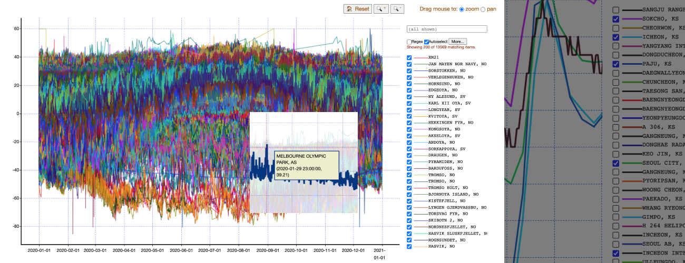

# Croquis: plot graphs 100x faster on Jupyter Notebook

Croquis is a lightweight Python library for drawing interactive graphs *really
fast* on Jupyter Notebook.  It lets you effortlessly browse and examine much
larger data than other similar libraries.



**Install croquis by running:**

```
pip install croquis
```

👉 Please look at the [tutorial](doc/tutorial.md) for more example.

---

You might be wondering: there are already many [mature](https://matplotlib.org/)
and [feature-rich](https://plotly.com/python/) plotting
[libraries](https://bokeh.org/) — what's the appeal of a new, experimental
library?  Well, croquis is built with the following goals in mind:

- **Fast:** Croquis contains a multi-threaded C++ plotting engine which
  automatically parallelizes graph generation, easily handling gigabytes
  of data.
- **Simple:** Croquis provides a unified, simple API, regardless of data size.
  Whether your data contains ten data points or fifty million, you can make the
  same three function calls (or as many calls as you wish in a loop, if you
  prefer).  The library will handle the rest.
- **Interactive:** Since the C++ engine is alive as long as your figure is
  visible, at any moment you can zoom in, move around, or select a different
  subset of your data, and the figure will update accordingly.

As an example,
[here](https://github.com/yongjik/croquis-extra/tree/master/noaa_temperature_data)'s
hourly ground temperature data of 2020 from the world's
weather stations, downloaded from [NOAA website](https://www.ncdc.noaa.gov/isd/data-access).
The data set contains 127 million points.

https://user-images.githubusercontent.com/31876421/123535161-0b402d00-d6d7-11eb-9486-6218279eda9d.mp4

The word "croquis" means [a quick, sketchy drawing](https://en.wikipedia.org/wiki/Croquis) -
it's from French *croquis* which simply means "sketch."  (The final -s is
silent: it's French, after all.)

## Requirements

- 64-bit Linux/Mac OS running on x86 with
  [AVX2](https://en.wikipedia.org/wiki/Advanced_Vector_Extensions#CPUs_with_AVX2)
  instruction set support.  (Intel: Haswell (2013) or later; AMD: Excavator
  (2015) or later.)
  - Windows support is under work.
  - Sorry, other architectures aren't supported yet.
- Python 3.6 or later.
- Jupyter Notebook.
- A modern browser (if it can run Jupyter Notebook, it's probably fine).

## How to install

```
pip install croquis
```

For building from the source, see [DEVELOPMENT.md](DEVELOPMENT.md).

To test if it's working correctly, try this inside Jupyter Notebook:

```
# Paste into a Jupyter cell.

import croquis
import numpy as np

N = 1000000
X = np.random.normal(size=(N, 1))
Y = np.random.normal(size=(N, 1))
labels=['pt %d' % i for i in range(N)]

fig = croquis.plot()
fig.add(X, Y, marker_size=3, labels=labels)
fig.show()
```

It should generate a plot like this:


For documentation, see the [tutorial](doc/tutorial.md) and the (very short)
[reference](doc/reference.md).

By the way, this library is of course open source (MIT License) and totally free
to use, but just in case you really liked it for some reason, the author could
use a cup of coffee or two... :)

[](https://www.buymeacoffee.com/yongjikkim)

## Limitations

Croquis is still experimental: as of version 0.1, we only support the **absolute
bare minimum** functionality.  In particular:

- Only line plots are supported, nothing else: no bars, pie charts, heatmaps, etc.
- All lines are solid: no dotted/dashed lines.
- All markers are solid circles: no other shapes are currently supported.
- No subplots: each Jupyter cell can contain only one graph.
- Very few options to customize the plot.  No titles, axis labels, or secondary axes.
- No support for mobile browsers.
- No dark mode.
- As you can see, the UI is rather primitive.

If croquis seems useful to you, but some features are missing for your use case,
then please feel free to file an issue.  (Of course I can't guarantee anything,
but it will be nice to know that someone's interested.)

## FAQ

### Is it really 100 times faster?

With large data, croquis can be *several hundred times* faster than other
popular libraries.  With very small data, there's less difference, as fixed-size
overheads start to dominate.

### Can we use it outside of Jupyter Notebook?

No, croquis is currently tied to Jupyter's message passing architecture, and all
computation is done in the backend, so it needs an active Jupyter Python
kernel.

### How does it work?

Unlike most other similar libraries, croquis works by running a C++ "tile
server," which computes fixed-sized "tiles" which is then sent back to the
browser.  If you have used Google Maps, the idea should be familiar.  This has
an important advantage:

- The browser only has to know about tiles.  Hence, the size of the data the
  browser needs to know is independent of the data set size.

As a result, the browser stays lean and "snappy" even with massive data.
(As explained in the [reference](doc/reference.md), we support `copy_data=False`
option that even eliminates data copies altogether.)

Moreover, unlike the browser's single-threaded javascript code, the C++-based
tile server can draw multiple tiles in parallel, which allows even more speedup.

(On the other hand, there are drawbacks - we have to basically re-implement every
graph drawing algorithm inside this tile server, not being able to use any
javascript API, except for very trivial things like coordinate grids.)
