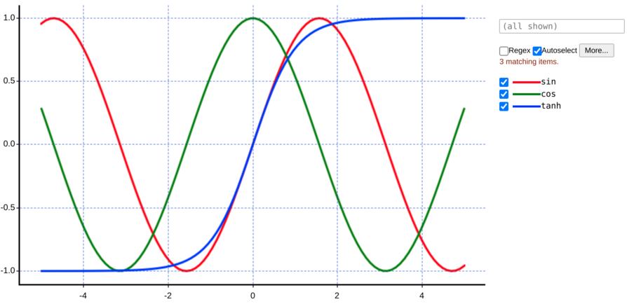
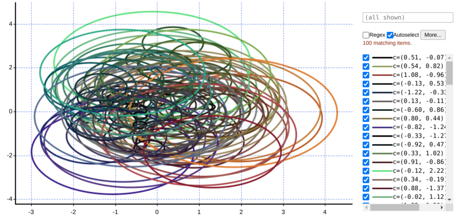
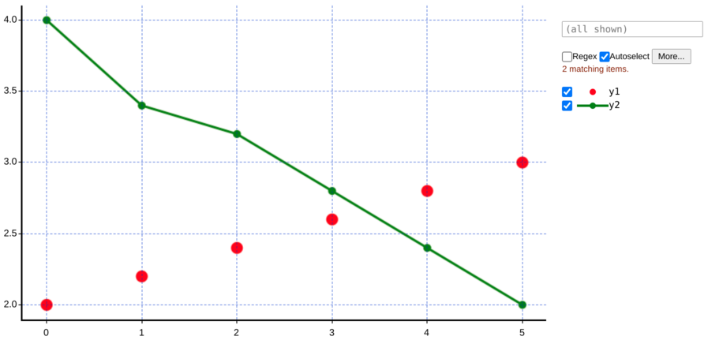
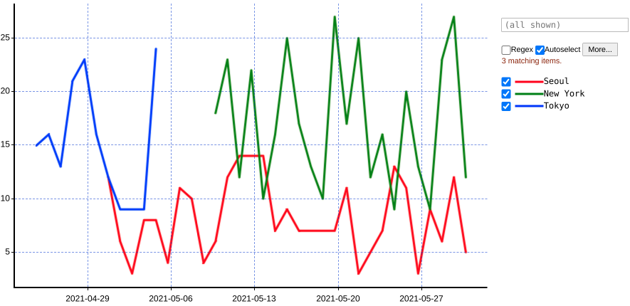

# Getting started with croquis

> 👉 For API reference, please see [reference.md](reference.md).

Creating a graph involves the following three steps:

1. Create a figure object: `fig = croquis.plot(...)`
2. Add one or more lines: `fig.add(x, y, ...)`
3. Generate the figure: `fig.show()`

Step 2 can be repeated as many times as you want: the first two arguments must
always be X and Y coordinates; the rest are options.  Now let's see some
examples.

## Adding multiple lines, one by one

```
# Please paste into a Jupyter cell.

import croquis
import numpy as np

fig = croquis.plot()

for fn in np.sin, np.cos, np.tanh:
    X = np.linspace(-5, 5, 100)
    Y = fn(X)
    fig.add(X, Y, label=fn.__name__)

fig.show()
```



The size of the graph will automatically adjust to match the browser window.
(Sorry, currently there's no option to manually modify graph dimension.)

## Adding multiple lines at once

While the previous code works, it's not the most efficient way to handle large
data.  If your data is already in a rectangular block, you can add them at once:

```
fig = croquis.plot()

X = np.linspace(0, 2 * np.pi, 200)
freqs = np.linspace(0, 1, 100).reshape(100, 1)
Y = np.sin(freqs * X)  # matrix of size 100 x 200
fig.add(X, Y, labels=['freq=%.2f' % f for f in freqs])

fig.show()
```

This will show 100 pieces of sine waves, each with a different frequency.


Here, `labels` is optional: if you omit it, then croquis will give each line a
boring, unimaginative name such as "Line #0", "Line #1", etc.  If you do specify
`labels`, it must be a list of strings (or something that can be converted to
it), and its length must equal the number of lines you're adding.

(Astute readers may notice that the first example used `label` while the second
used `labels`: `label` is just a shorthand when you are adding exactly one
line.)

## Adding multiple lines with different X, Y coordinates

In the previous example, the same x coordinate is shared by all lines.  (Readers
familiar with the concept of [NumPy's broadcasting](https://numpy.org/doc/stable/user/basics.broadcasting.html)
may notice similarity.)  However, of course, that's not necessary.

```
fig = croquis.plot()

Theta = np.linspace(0, 2 * np.pi, 200)
Cx = np.random.normal(size=100)
Cy = np.random.normal(size=100)
R = np.random.uniform(low=0.1, high=2.5, size=100)

# Here, X and Y are 100x200 matrices - each row contains 200 points that
# comprise a circle.
X = Cx.reshape(100, 1) + R.reshape(100, 1) * np.cos(Theta)
Y = Cy.reshape(100, 1) + R.reshape(100, 1) * np.sin(Theta)

# (Optional) having some fun with colors:
#      green
#        ^
# blue <-+-> red
# (Smaller circles are darker.)
colors = np.zeros((100, 3))
colors[:, 0] = (Cx * 0.2 + 0.5).clip(0.0, 1.0)
colors[:, 2] = 1.0 - colors[:, 0]
colors[:, 1] = (Cy * 0.2 + 0.5).clip(0.0, 1.0)
colors *= R.reshape(100, 1) / 2.5

fig.add(X, Y, colors,
        labels=['c=(%.2f, %.2f) r=%.2f' % x for x in zip(Cx, Cy, R)])

fig.show()
```

Here we also specified `colors`: if given, it must be a matrix of shape `(N,
3)`, where `N` is the number of lines.  Each row is the RGB value for the line.
If it is an integer type, the range is `[0, 255]`; for floats, the range is
`[0.0, 1.0]`.



(Sorry, fixed aspect ratio is not supported yet, so the "circles" appear
squashed.)

## Scatter plot

Even though croquis doesn't have the concept of a "scatter plot" per se, we can
generate one by giving it "lines" that are made of single points.  Here's an
example of a Gaussian distribution.

```
N = 1000000
X = np.random.normal(size=(N, 1))
Y = np.random.normal(size=(N, 1))
labels=['pt %d' % i for i in range(N)]

fig = croquis.plot()
fig.add(X, Y, marker_size=3, labels=labels)
fig.show()
```


## Reading data from CSV

Here's an example of reading a simple CSV file using pandas.  The [example CSV
file](ex5.csv) contains three columns: `x`, `y1`, and `y2`.

```
import pandas as pd

df = pd.read_csv('ex5.csv')
fig = croquis.plot()
fig.add(df.x, df.y1, label='y1', line_width=0, marker_size=15)
fig.add(df.x, df.y2, label='y2', line_width=3, marker_size=10)
fig.show()
```



As shown here, you can change line style (in a **very** limited way) by using
`line_width`, `marker_size`, or `highlight_line_width` parameters.  (The last
one specifies width of the line when highlighted by mouse hovering.)

## Reading data from CSV, irregular shape, with timestamps

Sometimes your data contains multiple lines with different lengths.  For
example, imagine [your data](ex6.csv) contains the following:

| date       | location | sales |
| :---       | :---     |  ---: |
| 2021-05-01 | Seoul    |    12 |
| 2021-05-02 | Seoul    |     6 |
| ...        | ...      |   ... |
| 2021-05-31 | Seoul    |     5 |
| 2021-05-10 | New York |    18 |
| 2021-05-11 | New York |    23 |
| ...        | ...      |   ... |
| 2021-05-31 | New York |    12 |
| 2021-04-25 | Tokyo    |    15 |
| 2021-04-26 | Tokyo    |    16 |
| ...        | ...      |   ... |
| 2021-05-05 | Tokyo    |    24 |

Of course, you can read this data, iterate over unique values of `location`, and
add lines one by one.  However, croquis also supports plotting multiple lines
with different lengths, which is more efficient especially when the data is big.
In order for that, you need to "squash" X and Y so that they are 1-dimensional
arrays, and then supply another argument `start_idxs` which is the index inside
X and Y where each new line starts.  See the comments on `start_idxs` in the
[reference](reference.md) for details.

Creating `start_idxs` from CSV data needs a bit of fiddling:

```
df = pd.read_csv('ex6.csv')

# If necessary, sort data so that each location appears contiguously.
df = df.sort_values(['location', 'date'])

# Create start_idxs.
locations, counts = np.unique(df['location'].to_numpy(), return_counts=True)
start_idxs = np.zeros_like(counts)
start_idxs[1:] = np.cumsum(counts)[:-1]

# Here, start_idxs = [0, 22, 53]:
#   df[0:22] is the first line (New York)
#   df[22:53] is the second line (Seoul)
#   df[53:] is the third line (Tokyo)

fig = croquis.plot(x_axis='timestamp')
fig.add(pd.to_datetime(df.date), df.sales, start_idxs=start_idxs,
        labels=locations)
fig.show()
```

Here, we also use pandas to transform date strings to datetime values.  In order
to show dates, you have to create the plot object with `x_axis='timestamp'` -
x coordinates can be given as either `np.datetime64` type or plain numbers (in
which case it is interpreted as
[POSIX timestamps](https://en.wikipedia.org/wiki/Unix_time)).



## The search box

The right-hand side contains a search box: "Regex" enables regular expression.
By default, "Autoselect" is on, which means what appears on the graph is exactly
what matches your search expression (or everything, if the search box is empty).

When "Autoselect" is off, the selection is independent from search results: you
can search and click on individual items to turn them on/off.
